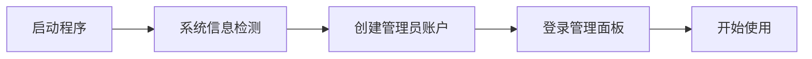

# Caddy 管理器


> 一个轻量级的 Caddy 可视化管理程序，专为 Windows 设计，提供类似宝塔面板的傻瓜式体验。

## ✨ 核心特性

| 特性 | 说明 |
|------|------|
| 🖥️ **图形化界面** | 响应式 Web UI，简洁易用 |
| 📊 **系统监控** | 实时显示系统信息和环境状态 |
| ⚙️ **站点管理** | 静态站点、反向代理、PHP 站点一键配置 |
| 🔐 **SSL 证书** | Let's Encrypt 自动申请与续期 |
| 🧩 **环境检测** | 自动检测并引导安装 Python/Node.js/Java/Go/PHP |
| 📁 **文件管理** | 可视化浏览、上传、下载、删除文件 |
| 📝 **日志查看** | 实时查看 Caddy 运行日志 |
| 🔒 **安全路径** | 自定义访问路径，防止恶意扫描 |
| 👤 **用户管理** | 修改管理员用户名和密码 |
| 🚀 **自动启动** | 程序启动时自动运行 Caddy |
| 🧱 **轻量高效** | Go + SQLite，单文件约 10MB |

## 🚀 快速开始

### 方式一：直接运行

```bash
# 双击启动脚本
start.bat

# 或直接运行
caddy-manager.exe
```

### 方式二：从源码构建

```bash
# 克隆项目
git clone https://github.com/ikki99/10w_caddysever.git
cd 10w_caddysever

# 编译（需启用 CGO）
set CGO_ENABLED=1
go build -o caddy-manager.exe

# 运行
caddy-manager.exe
```

**默认访问地址**：`http://localhost:8989`

## 📖 使用指南

### 首次使用流程



1. **系统信息检测**
   - 自动显示操作系统、CPU、内存信息
   - 检测已安装的运行环境（PHP/Python/Node.js/Java/Go）
   - 点击"继续登录"进入下一步

2. **创建管理员**
   - 首次运行需设置管理员账户
   - 输入用户名和密码（至少 6 位）

3. **登录管理**
   - 使用创建的账户登录
   - 如设置了安全路径，需通过 `http://IP:8989/安全路径` 访问

### 站点管理

#### 1. 静态站点
适用于纯 HTML/CSS/JS 项目

```yaml
站点名称: my-website
绑定域名: www.example.com
网站目录: C:\www\my-website
是否启用 HTTPS: 是
```

#### 2. 反向代理
适用于 Node.js、Python、Go 等后端服务

```yaml
站点名称: api-server
绑定域名: api.example.com
项目类型: 反向代理
后端地址: http://localhost:3000
是否启用 HTTPS: 是
```

#### 3. PHP 站点
需先安装 PHP 环境

```yaml
站点名称: wordpress
绑定域名: blog.example.com
项目类型: PHP
网站目录: C:\www\wordpress
PHP 版本: 8.2
是否启用 HTTPS: 是
```

### 文件管理

- **浏览目录**：可视化浏览 www 根目录
- **上传文件**：拖拽或选择文件上传
- **下载文件**：点击文件名下载
- **新建文件夹**：创建新目录
- **删除操作**：删除文件或文件夹
- **修改根目录**：在系统设置中配置

### 环境部署

程序会自动检测以下环境：

| 环境 | 检测方式 | 安装指南 |
|------|---------|---------|
| Python | `python --version` | [下载链接](https://www.python.org/downloads/) |
| Node.js | `node --version` | [下载链接](https://nodejs.org/) |
| Java | `java -version` | [下载链接](https://www.oracle.com/java/technologies/downloads/) |
| Go | `go version` | [下载链接](https://go.dev/dl/) |
| PHP | `php -v` | [下载链接](https://windows.php.net/download/) |

未安装的环境会显示"未安装"状态，点击"安装指南"查看详细步骤。

### 系统设置

#### 安全访问路径
设置后访问地址变为：`http://localhost:8989/your-custom-path`

**注意**：
- 不设置安全路径时，直接访问 `http://IP:8989` 会显示错误提示
- 设置后必须通过完整路径访问
- 防止恶意扫描和未授权访问

#### 网站根目录
所有网站文件的存放路径，默认 `C:\www`

#### 修改密码
需要输入旧密码验证后才能修改

## 📁 目录结构

```
caddy-manager/
├── data/                      # 数据目录
│   ├── caddy/                 # Caddy 相关文件
│   │   ├── caddy.exe          # Caddy 可执行文件（自动下载）
│   │   ├── Caddyfile          # Caddy 配置文件（自动生成）
│   │   └── caddy.log          # Caddy 运行日志
│   └── caddy-manager.db       # SQLite 数据库
├── web/                       # 前端静态文件
│   └── index.html             # 管理界面
├── internal/                  # 后端代码
│   ├── database/              # 数据库操作
│   ├── models/                # 数据模型
│   ├── handlers/              # HTTP 处理器
│   └── utils/                 # 工具函数
├── caddy-manager.exe          # 主程序
├── start.bat                  # 启动脚本
├── build.bat                  # 编译脚本
├── go.mod                     # Go 依赖管理
└── README.md                  # 说明文档
```

## 🔧 技术栈

| 组件 | 技术 | 说明 |
|------|------|------|
| **后端** | Go 1.21+ | 高性能、跨平台 |
| **数据库** | SQLite 3 | modernc.org/sqlite（纯 Go 实现） |
| **Web 服务器** | Caddy 2 | 自动 HTTPS、简洁配置 |
| **前端** | HTML/CSS/JS | 原生实现，无依赖 |

## 🎯 功能路线图

- [x] v0.0.1 基础框架搭建
- [x] v0.0.2 站点管理功能
- [x] v0.0.3 文件管理功能
- [x] v0.0.4 环境检测功能
- [x] v0.0.5 安全路径设置
- [x] v0.0.6 系统信息面板
- [x] v0.0.7 Caddy 自动下载与启动
- [x] v0.0.8 修复安全路径重定向问题
- [ ] v0.0.9 系统托盘图标
- [ ] v0.1.0 多项目管理（Go/Python/Node.js）
- [ ] v0.2.0 计划任务管理
- [ ] v0.3.0 数据库管理（MySQL/PostgreSQL）
- [ ] v0.4.0 Docker 容器管理
- [ ] v1.0.0 正式版发布

## 📝 常见问题

<details>
<summary><b>Q: 如何让 Caddy 监听 80/443 端口？</b></summary>

需要以管理员权限运行程序：
```bash
# 右键 start.bat -> 以管理员身份运行
# 或右键 caddy-manager.exe -> 以管理员身份运行
```
</details>

<details>
<summary><b>Q: PHP 站点不工作？</b></summary>

1. 确保已安装 PHP 和 PHP-CGI
2. 启动 PHP-CGI FastCGI 服务：
   ```bash
   php-cgi.exe -b 127.0.0.1:9000
   ```
3. 或使用 Windows 服务方式运行
</details>

<details>
<summary><b>Q: 如何备份数据？</b></summary>

备份 `data` 目录即可，包含：
- `caddy-manager.db`：所有配置和站点信息
- `caddy/Caddyfile`：Caddy 配置文件
- `caddy/caddy.log`：运行日志
</details>

<details>
<summary><b>Q: 忘记密码怎么办？</b></summary>

删除 `data/caddy-manager.db` 文件，重启程序即可重新初始化。

**注意**：此操作会清除所有站点配置和设置！
</details>

<details>
<summary><b>Q: 为什么访问 IP:8989 显示错误？</b></summary>

这是安全设计。需要：
1. 在系统设置中设置安全路径（如 `admin`）
2. 通过完整路径访问：`http://IP:8989/admin`

如不需要此功能，可在设置中清空安全路径。
</details>

<details>
<summary><b>Q: Caddy 未运行怎么办？</b></summary>

1. 检查 `data/caddy/caddy.exe` 是否存在
2. 查看 `data/caddy/caddy.log` 日志
3. 手动启动测试：
   ```bash
   cd data\caddy
   caddy.exe run --config Caddyfile
   ```
</details>

## 🔗 相关链接

- [Caddy 官网](https://caddyserver.com/)
- [Caddy 文档](https://caddyserver.com/docs/)
- [PHP 下载](https://windows.php.net/download/)
- [Node.js 下载](https://nodejs.org/)
- [Python 下载](https://www.python.org/downloads/)
- [参考项目: CaddyDash](https://github.com/WJQSERVER-STUDIO/caddydash)

## 🤝 贡献

欢迎提交 Issue 和 Pull Request！

1. Fork 本仓库
2. 创建特性分支 (`git checkout -b feature/AmazingFeature`)
3. 提交更改 (`git commit -m 'Add some AmazingFeature'`)
4. 推送到分支 (`git push origin feature/AmazingFeature`)
5. 开启 Pull Request

## 📄 许可证

本项目采用 MIT 许可证。详见 [LICENSE](LICENSE) 文件。

## 🙏 致谢

- [Caddy](https://caddyserver.com/) - 现代化的 Web 服务器
- [modernc.org/sqlite](https://gitlab.com/cznic/sqlite) - 纯 Go 实现的 SQLite
- [CaddyDash](https://github.com/WJQSERVER-STUDIO/caddydash) - 提供参考思路

---

<p align="center">
  Made with ❤️ by <a href="https://github.com/ikki99">ikki99</a>
</p>
